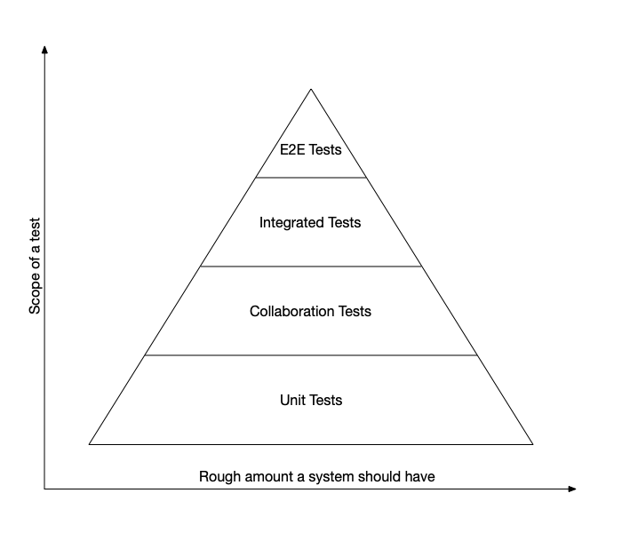

# Kinds of Tests

An overview of the different kinds of automated tests.

There are 4 broad categories of tests, defined by the scope of the test.

- End to End (or e2e) tests work by keeping everything as "real" as possible. They make network requests, talk to the db, and they try to interact with the system like a user would.
- Integrated tests are essentially end to end tests that don't make network calls. Sometimes they don't test the UI interactions, and instead deal with whatever the UI actually uses.
- Integration, or collaboration tests "cover the integration between subsystems, systems, or any nontrivial client/supplier relationship". [^integration test definition]
- Unit tests cover a single component within a system or subsystem.

## Testing Pyramid

I subscribe to the idea of the testing pyramid, which describes the scope of tests on the vertical axis, and the amount you should have.

This is also shown in [this page on the testing pyramid from testdouble's contributing-tests wiki](https://github.com/testdouble/contributing-tests/wiki/Testing-Pyramid).

## End to End Tests

End to End tests have a ton of overhead involved. They typically involve standing up or using an existing production-like environment (a staging or testing environment). This takes a ton of time, requires a lot of maintenance, and makes them inherently brittle.

I'm clearly not a fan of end to end tests, but they do have their place at the very top of the testing pyramid. But even then, what they actually check for can be checked in much better way with collaboration tests.

[Google Testing Blog on End to End Tests](https://testing.googleblog.com/2015/04/just-say-no-to-more-end-to-end-tests.html).

## Integrated Tests

Integrated tests are essentially a lower-overhead version of End to End tests. Like end to end tests, they try to avoid doubling out as much things as possible. But integrated tests stop by not making network requests. They typically also make shortcuts for the database by using an in-memory database. For a microservice, this means that they only test code in the microservice. In a monolith or a desktop app, then the test surface is much larger.

These shortcuts make integrated tests take less time to run and makes them a little less brittle, and they do have similar uses in checking that things work together. Still, it's a mistake to have too much on them.

[J. B. Rainsberger on Integrated Tests](https://blog.thecodewhisperer.com/permalink/integrated-tests-are-a-scam)

## Collaboration Tests

Collaboration tests ensure that two components can correctly integrate with each other. These need to be focused to just verifying the test. This makes them very useful, as it's much faster to write collaboration tests than integrated tests, these run much faster, and they're significantly less brittle.

Still, collaboration tests should only be written to verify integrations between systems or with nontrivial client/supplier relationships. I very commonly write collaboration tests that verify a Controller correctly responds to an event from a View. And that's about it. Everything else can be covered by a contract test, which is a kind of unit test.

## Unit Tests

Unit tests should be the vast majority of your automated tests. Frankly, that test pyramid should look something more like this:

That E2E layer (at 0.5 pixels wide) is likely wider than it should be, at this scale.

Unit tests are very fast, highly focused test. They test a single behavior in a single component. That component can be an object, a method on an object, a freestanding function, or whatever. Unit tests use test doubles to double out any other component in the system - other types that might be called.

There are many types of unit tests, one earlier mentioned one is a contract test.

### Contract Tests

Contract tests are tests that define how a type conforms to a superclass or implements an interface/protocol. To apply a [SOLID]({{#path_for SOLID}}) principle, Contract Tests ensure that Liskov Substitution is complied with.

Contract tests are typically written to be fairly generic: they take in a factory for the type, and use that to get the subject being tested. This subject is then run through a number of tests to verify that its behavior matches. One way to do this is to write the contract test as a subclassable test. Another way is something like [Quick's Shared Examples](https://github.com/Quick/Quick/blob/main/Documentation/en-us/SharedExamples.md).

Contract tests should be written anytime you have more than 1 conformer to an interface (or whenever you expect a class to be subclassed).

Contract tests are very powerful and very useful, and they're not used nearly as often as they should be.

[^integration test definition]: [""Integration Tests are a scam" is a scam" -  J. B. Rainsberger](https://blog.thecodewhisperer.com/permalink/integration-tests-are-a-scam-is-a-scam)

